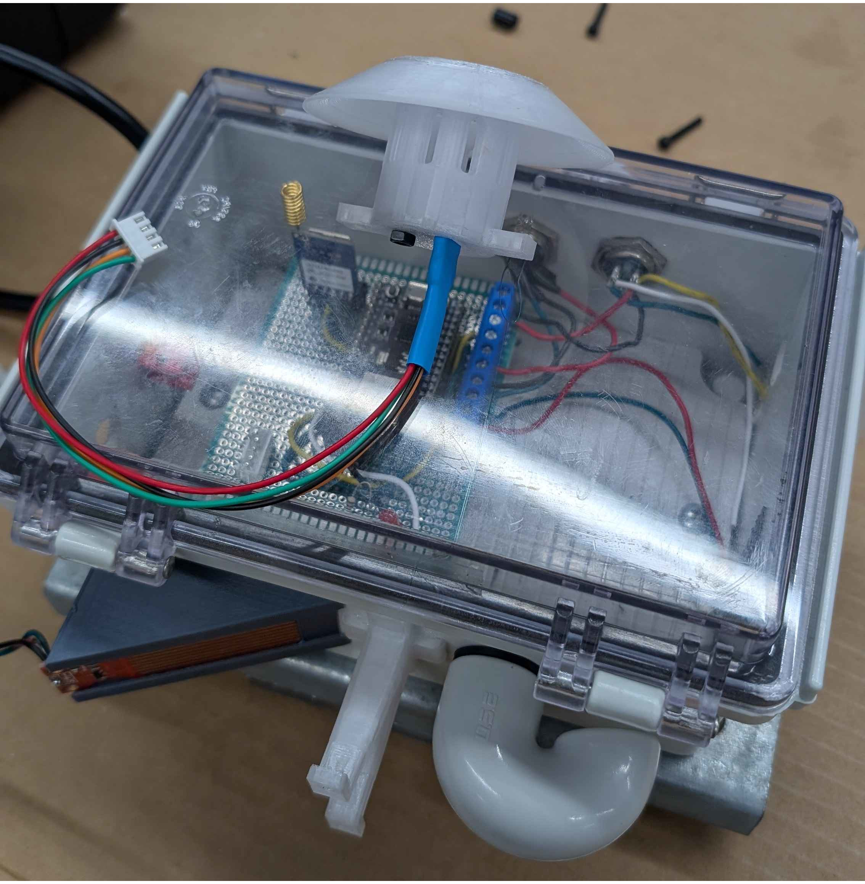
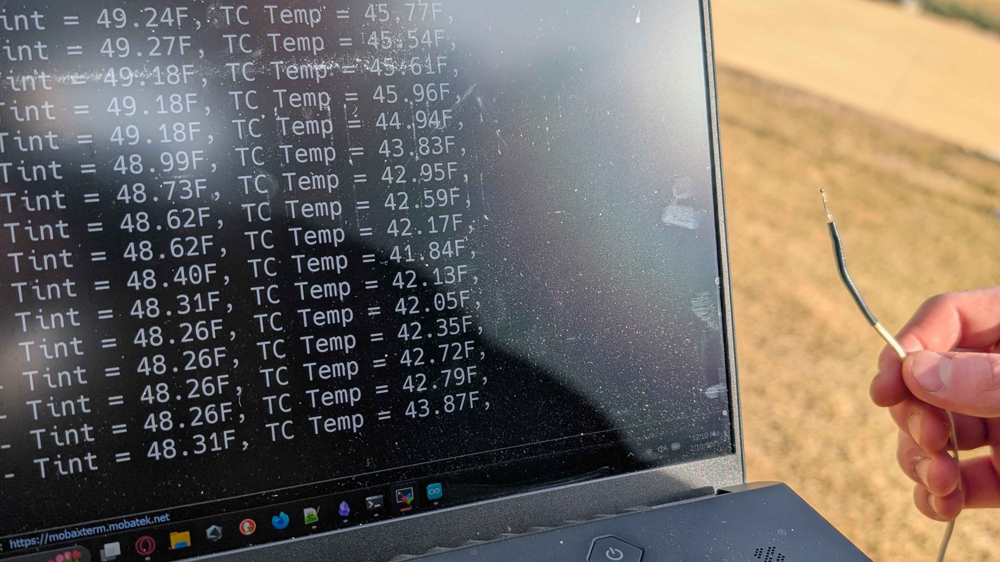

# Sensor Issues

During the development of the weather station, it was found that the temperature sensor mounted internally was causing the station to report very high temperatures compared to the "real" ambient temperature reported by the NWS (20-40 degrees higher). The leading theory for this issue was that the BECC building was cooking the sensor and artificially raising the temperature of the sensor.

The solution to this problem was to mount the sensor outside the box in a small, well-ventilated enclosure, which was implemented. 

> New 3d-printed case manufactured out of PETG enclosing the weather station's temperature sensor

# The Temperature was Wrong... again?

After mounting the new sensor, it was found that the temperature was **still** ten degrees higher than what the National Weather Service and other sources were reporting. Again, the theory was still that the BECC was cooking the sensor. To verify this, a thermocouple measurement board was used to detect the ambient air temperature around the building and... it was the same as what the sensor was reporting. 

> Measuring the ambient air temperature with a thermocouple using a [Playing with Fusion FDQ-30001 board](https://playingwithfusion.com/productview.php?pdid=229)

It was clear that the issue was simply the weather station was too close to the BECC and that the glass and concrete were radiating too much heat to get an accurate measurement for ambient air temperature.

# What was Done Wrong

It all started when we mounted the Weather Station: the location was not conducive to accurately measuring ambient temperature. The large glass building was reflecting the sunlight towards the Weather Station's location, heating it to well above ambient temperature. 

After some research, we found an article about [measuring ambient air temperature](https://www.nist.gov/how-do-you-measure-it/how-do-you-measure-air-temperature-accurately), and one of the major issues listed was: "Don't put ambient air measurement equipment near large buildings or pavement." With the current Weather Station location in front of the BECC, **we were doing exactly that**.

# The New Test

These issues arose a question: is campus as a whole truly that much warmer, or was this issue just in front of the BECC? To find the answer to this, the team went around campus measuring a couple points and comparing that data to the National Weather Service reported data. Unfortunately, the day chosen to perform these measurements was bitterly cold, and the team only got about four locations measured. 

**Test was conducted on 2025-02-13, at around 1:00pm**

**This data can be visualized with the GPS data with the [Test Html](../ws-2025-02-13-outdoor-test.html).**

## Our Test Data

| Time | Temp (C) | Pressure (kPa) |
| --- | --- | --- |
| 13:19 | 10.7 (C) | 100.9 kPa | 
| 13:22 | 7.8 (C) | 100.9 kPa | 
| 13:26 | 5.5 (C) | 100.9 kPa | 
| 13:31 | 2 (C) | 101.0 kPa | 

## NWS Data

| Time | Temp (C) | Pressure (kPa) |
| --- | --- | --- |
| 13:54 | -8.0 (C) | -- | 
| 12:54 | -8.8 (C) | -- | 

---

*Last Updated 2025-02-13-20:45 by Jacob S*